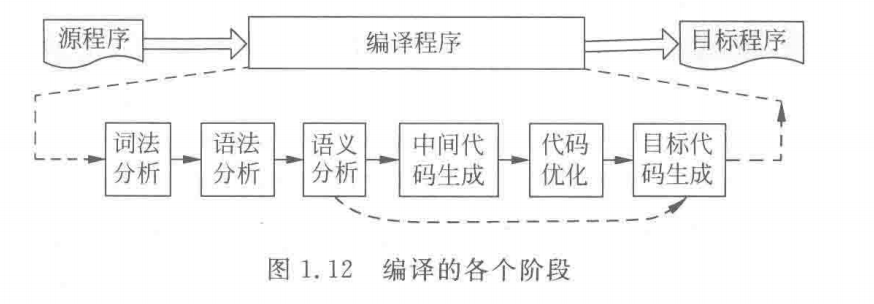

---

title: C语言程序经过预处理、编译、汇编和链接等各个阶段的变化情况
author: John Doe
tags:
  - 基础概念
categories:
  - 编译原理
date: 2022-03-08 15:59:00
---

编译过程概述：通常编译程序的过程分为词法分析、语法分析、语义分析、目目标代码生成4个阶段（如果编译器支持优化，还可以有中间代码生成和代码优化两个阶段）。

 
 
1、词法分析

此阶段的任务是从左到右一个字符一个字符地读入源程序，对构成源程序的字符进行扫描和分解，从而识别出一个个单词（逻辑上紧密相连的一组有集体含义的字符）。

2、语法分析

此阶段的任务是在词法分析的基础上将单词序列分解成各类语法短语（也称语法单位）可表示成语法树。

注：词法分析和语法分析本质上都是对源程序的结构进行分析。

3、语义分析

语义分析是审查源程序有无语义错误，为代码生成阶段收集类型信息。

4、中间代码生成

“中间代码”是一种结构简单，含义明确的记号系统，这种记号系统可以设计为多种多样的形式，重要的设计原则为两点：一是容易生成；二是容易将它翻译成目标代码。很多编译程序采用了一种近似“三地址指令”的“四元式”中间代码。这种四元式的形式为：（运算符，运算对象1，运算对象2，结果）

5、代码优化

将中间代码进行变换或进行改造，目的：使生成的目标代码更为高效，即省时间和空间

6、目标代码生成

任务是把中间代码变换成特定机器上的绝对指令代码或可重定位的指令代码或汇编指令代码。
