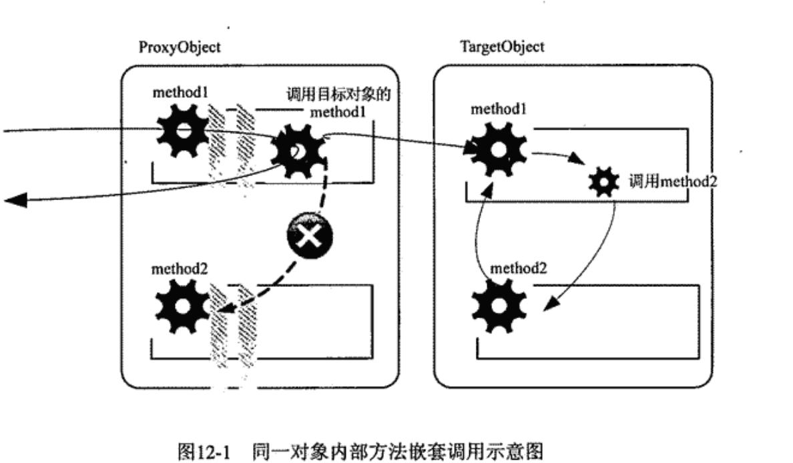

---

title: Spring AOP实现机制的一个小小陷阱
author: John Doe
tags:
  - AOP
categories:
  - Spring
date: 2022-03-08 20:36:00
---

我们知道Spring AOP采用代理模式实现，具体的横切逻辑会被添加到动态生成的代理对象中，只要调用的是目标对象的代理对象上的方法就可以保证目标对象的方法执行可以被拦截。

不过遗憾的是，代理模式的实现机制在处理方法调用的时序方面会给使用这种机制实现的AOP产品造成一个缺憾。在处理对象方法中，不管你如何添加横切逻辑，也不管添加多少横切逻辑，有一点是确定的，你最终需要调用目标对象的同一方法来执行最初所应以的方法逻辑。如果目标对象中原始方法调用依赖于其他对象，那没问题。我们可以为目标对象注入所依赖对象的代理，并且可以保证相应的Joinpoint被拦截并且织入相应横切逻辑。但是如果目标对象中的原始方法调用直接调用自身方法时，会导致出现问题

 
 
 在代理对象的method1执行经历了层层拦截后，最终会将调用转向目标对象上的method1，之后调用流程全部在走targetobject之上，当method1调用method2时，它调用targetobject的method2，而不是代理对象的method2，而针对method2的横切逻辑是织入到代理对象上的，因此method1中调用的method2没有被成功拦截。
 
 好在Spring AOP提供了AopContent来公开当前目标对象的代理对象，我们只要在目标对象中使用AopContent.currentProxy()就可以获取当前目标对象所对应的代理对象。
 
 
 