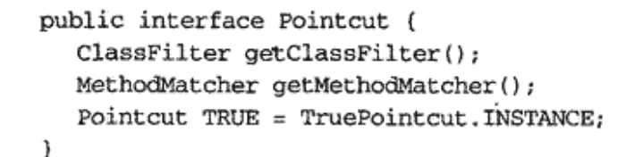
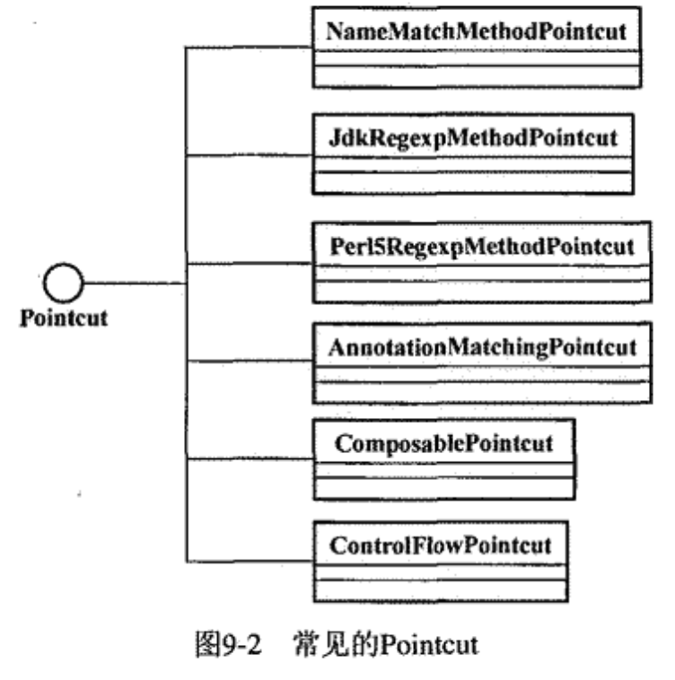
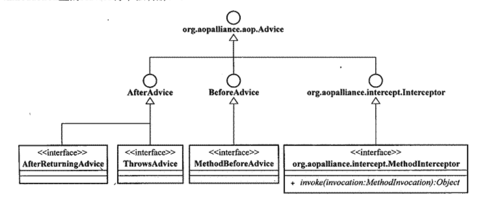

---

title: Spring AOP 一世
author: John Doe
tags:
  - AOP
categories:
  - Spring
date: 2022-03-07 20:03:00
---
AOP的Joinpoint可以有许多类型，入构造方法调用、字段的设置及获取、方法调用等。但是在Spring AOP中，仅支持方法级别的Joinpoint。更确切的说，只支持方法执行类型的Joinpoint

Spring中以接口定义Pointcut作为其AOP框架中所有Pointcut的最顶级抽象，该接口定义了两个方法来捕获系统中相应的Joinpoint，并提供了一个TruePointcut类型实例。如果Pointcut类型为TruePointcut，默认会对系统中的所有对象，以及对象上所有被支持的Joinpoint进行匹配。

 
 
 ClassFileter和MethodMatcher分别用于匹配将被执行织入操作的对象以及相应的方法。（重用不同级别的匹配定义，并且可以在不同或相同的级别上进行组合操作，或者强制让某个子类只覆写相应的方法）
 
 
 
 
 Spring中各种advice实现全部遵循AOP ALLiance规定的接口。
 
 
 advice实现了将被织入到Pointcut规定的Joinpoint处的横切逻辑。在Spring中，advice按照其自身实例能否在目标对象类的所有实例中共享这一标准，可以划分为两大类（per-class和per-instance）
 
 per-class类型的advice：该类型可以在目标对象类的所有实例之间共享。这种类型的advice通常只提供方法拦截的功能。不会为目标对象类保存任何状态或添加新特性。除了上图没有列出的intriuduction类型的advice外，其余都属于pre-class。（如：BeforeAdvice、ThrowsAdvic、AfterReturningAdvice、AroundAdvice等）
 
 per-instance类型的advice：introduction是唯一的一种per-instance型advice。其可以在不改目标类定义的情况下，为目标类添加新的属性和行为。
 
 当所有的Pointcut和advice准备好之后，就可以将其装入Aspect。
 
 
 