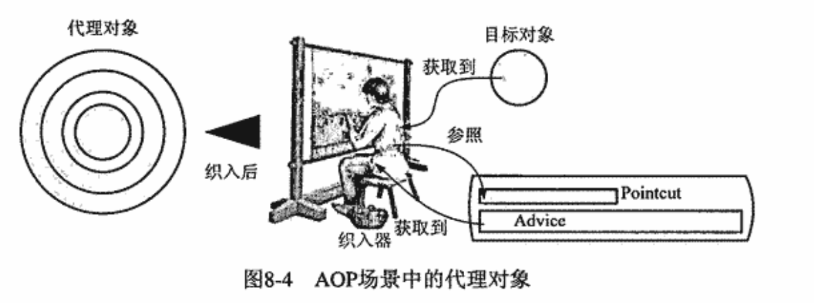

---

title: Spring AOP的实现机制
author: John Doe
tags:
  - AOP
categories:
  - Spring
date: 2022-03-07 19:43:00
---

Spring AOP采用动态代理机制（先尝试jdk动态代理，如果没有实现相应接口，则采用cglib字节码生成技术）和字节码生成技术实现（对目标对象进行继承拓展，为其生成相应的子类，子类通过重写来扩展父类的行为，只要将横切逻辑的实现放到子类中，然后让系统使用扩展后的子类即可）。与最初AspectJ采用编译器将横切逻辑织入到目标对象不同，动态代理和字节码生成都是在运行期间为目标对象生成一个代理对象，而将横切逻辑织入到这个代理对象中，系统最终使用的是织入横切逻辑的代理对象而不是真正的目标对象。

 
注意：动态代理需要实现统一接口，而cglib生成字节码需要方法可以重写