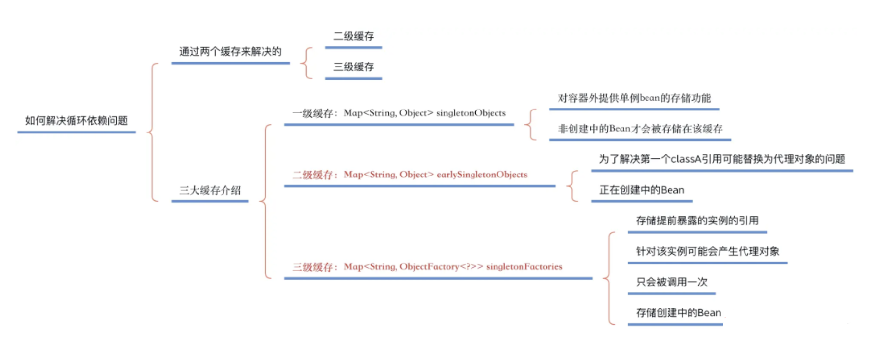
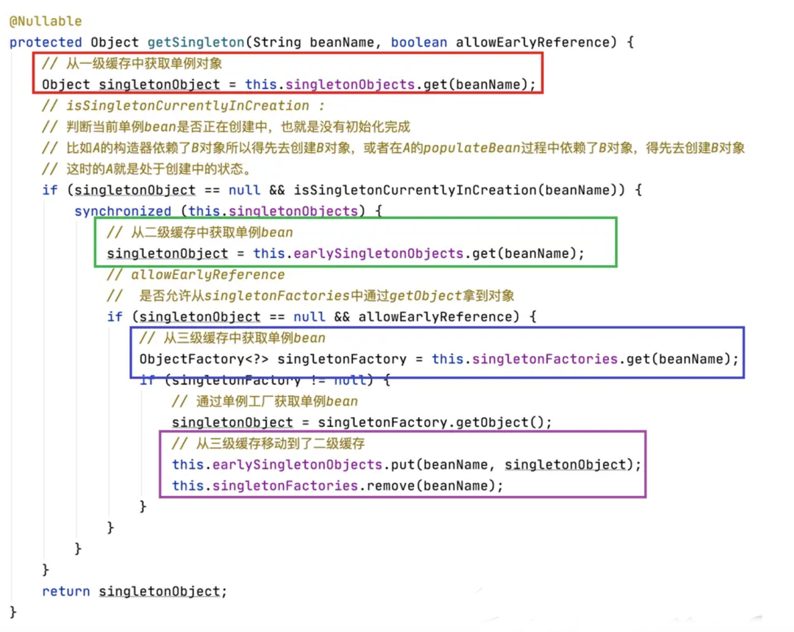
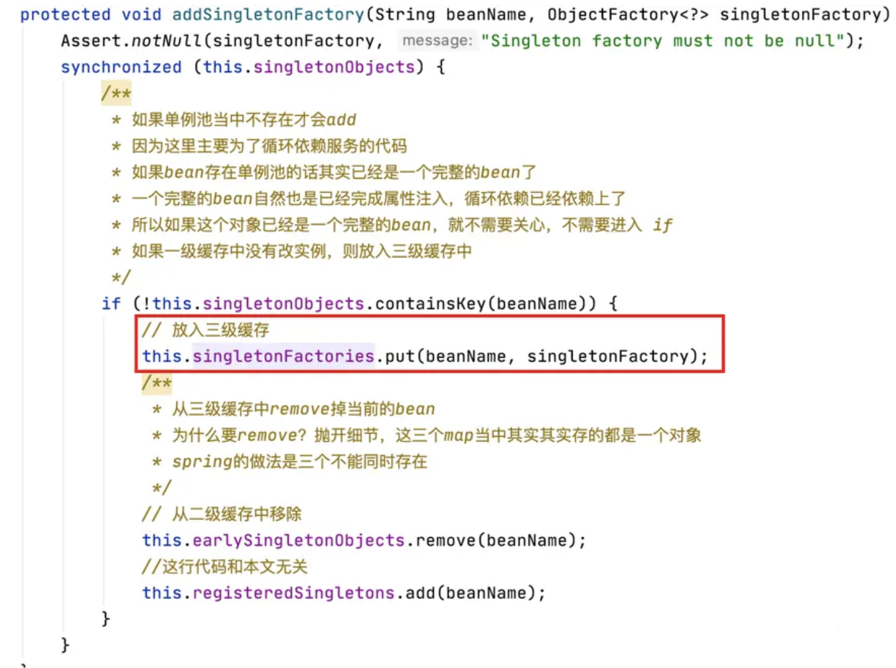
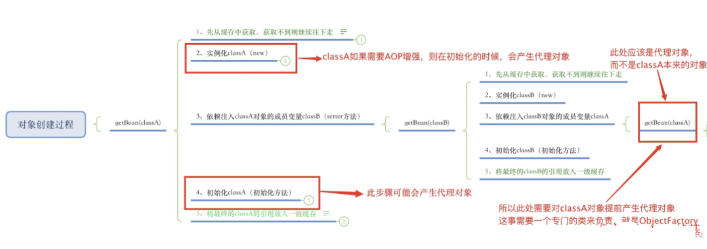
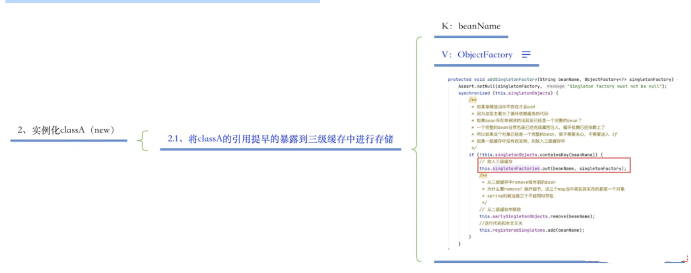

---

title: Spring是如何解决循环依赖问题的？
author: John Doe
tags:
  - 循环依赖
categories:
  - Spring
date: 2022-03-09 10:54:00
---
什么是循环依赖问题？

类与类之间的依赖关系形成了闭环，就会导致循环依赖问题的产生。（比如A类依赖了B类，B类依赖了C类，而最后C类又依赖了A类，这样就形成了循环依赖问题。）

循环依赖问题在Spring中主要有三种情况：

1、通过构造方法进行依赖注入时产生的循环依赖问题。

2、通过setter方法进行依赖注入且是在多例（原型）模式下产生的循环依赖问题。

3、通过setter方法进行依赖注入且是在单例模式下产生的循环依赖问题。

注意：在Spring中，只有【第三种方式】的循环依赖问题被解决了，其他两种方式在遇到循环依赖问题时都会产生异常。

因为第一种构造方法注入的情况下，在new对象的时候就会堵塞住了，其实也就是”先有鸡还是先有蛋“的历史难题。

第二种setter方法&&多例的情况下，每一次getBean()时，都会产生一个新的Bean，如此反复下去就会有无穷无尽的Bean产生了，最终就会导致OOM问题的出现。

如何解决循环依赖问题？

 
 
 Spring中有三个缓存，用于存储单例的Bean实例，这三个缓存是彼此互斥的，不会针对同一个Bean的实例同时存储。
 
 如果调用getBean，则需要从三个缓存中依次获取指定的Bean实例。读取顺序依次是一级缓存-->二级缓存-->三级缓存
 
 
 
 一级缓存：Map<String, Object> singletonObjects
第一级缓存的作用？

用于存储单例模式下创建的Bean实例（已经创建完毕）。
该缓存是对外使用的，指的就是使用Spring框架的程序员。

存储什么数据？

K：bean的名称

V：bean的实例对象（有代理对象则指的是代理对象，已经创建完毕）

第二级缓存：Map<String, Object> earlySingletonObjects第二级缓存的作用？

用于存储单例模式下创建的Bean实例（该Bean被提前暴露的引用,该Bean还在创建中）。
该缓存是对内使用的，指的就是Spring框架内部逻辑使用该缓存。
为了解决第一个classA引用最终如何替换为代理对象的问题（如果有代理对象）

存储什么数据？

K：bean的名称

V：bean的实例对象（有代理对象则指的是代理对象，该Bean还在创建中）

第三级缓存：Map<String, ObjectFactory<?>> singletonFactories第三级缓存的作用？

通过ObjectFactory对象来存储单例模式下提前暴露的Bean实例的引用（正在创建中）。
该缓存是对内使用的，指的就是Spring框架内部逻辑使用该缓存。
此缓存是解决循环依赖最大的功臣

存储什么数据？

K：bean的名称

V：ObjectFactory，该对象持有提前暴露的bean的引用

 

为什么第三级缓存要使用ObjectFactory？需要提前产生代理对象。

 
什么时候将Bean的引用提前暴露给第三级缓存的ObjectFactory持有？时机就是在第一步实例化之后，第二步依赖注入之前，完成此操作。

 

总结
以上就是Spring解决循环依赖的关键点！总结来说，就是要搞清楚以下几点：

搞清楚Spring三级缓存的作用？
搞清楚第三级缓存中ObjectFactory的作用？
搞清楚为什么需要第二级缓存？
搞清楚什么时候使用三级缓存（添加和查询操作）？
搞清楚什么时候使用二级缓存（添加和查询操作）？
当目标对象产生代理对象时，Spring容器中（第一级缓存）到底存储的是谁？

