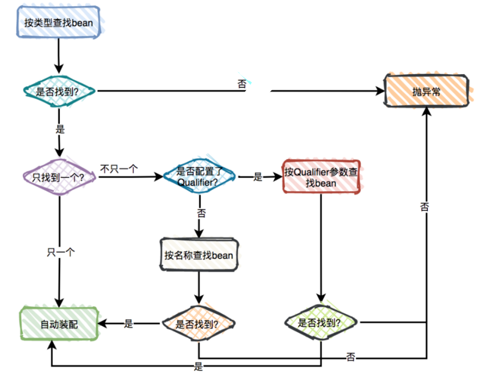

---

title: 使用@Autowired注解自动装配的过程是怎样的？
author: John Doe
tags:
  - 面试题
categories:
  - Spring
date: 2022-03-09 18:11:00
---
记住：@Autowired 通过Bean的后置处理器进行解析的

1、 在创建一个Spring上下文的时候再构造函数中进行注册AutowiredAnnotationBeanPostProcessor

2、 在Bean的创建过程中进行解析

	2.1、 在实例化后预解析（解析@Autowired标注的属性、方法   比如：把属性的类型、名称、属性所在的类..... 元数据缓存起）

	2.2、 在属性注入真正的解析（拿到上一步缓存的元数据 去ioc容器帮进行查找，并且返回注入）

a. 首先根据预解析的元数据拿到 类型去容器中进行查找 
（如果查询结果刚好为一个，就将该bean装配给@Autowired指定的数据；
如果查询的结果不止一个，那么@Autowired会根据名称来查找；
如果上述查找的结果为空，那么会抛出异常。解决方法时，使用required=false。）

 