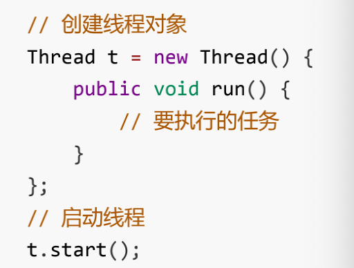
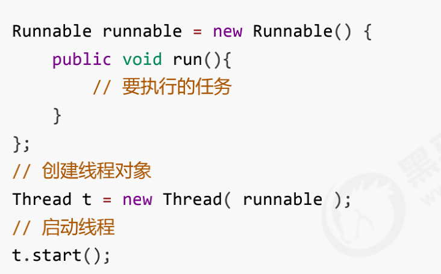

---

title: 创建线程的方式
author: John Doe
tags:
  - 创建线程
categories:
  - ''
date: 2022-01-24 19:02:00
---
1、创建Thread对象

 
 
 2、使用Runnable配合Thread使用
 
 
 
 
 3、FutureTask配合Callable和Thread使用
 
 
 
 
 4、通过线程池创建
 