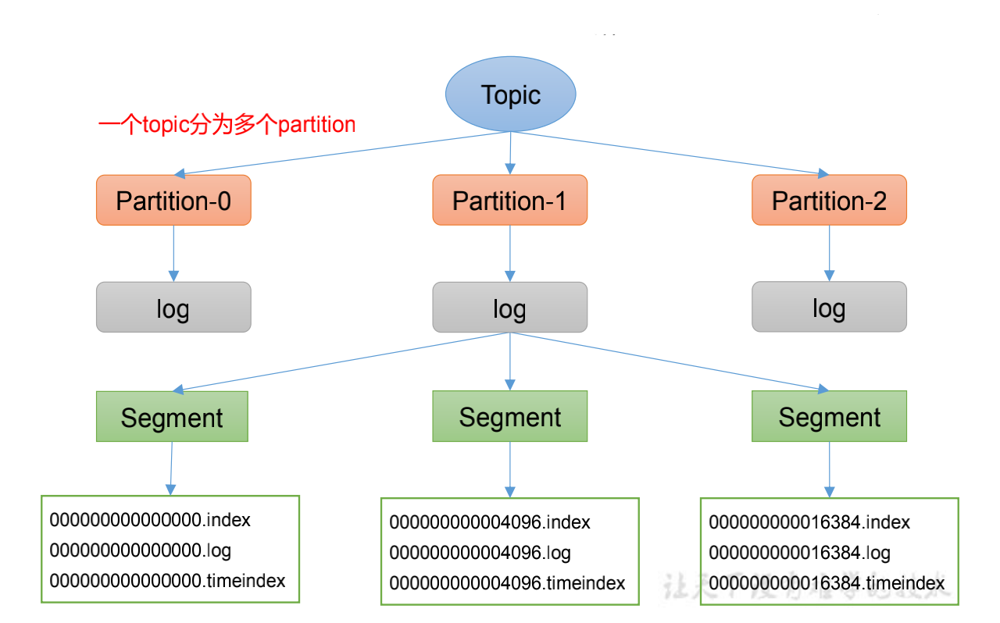

---

title: Kafka文件存储机制
author: John Doe
tags:
  - 文件存储
categories:
  - Kafka
date: 2022-03-12 11:16:00
---
Topic是逻辑上的概念，而partition是物理上的概念，每个partition对应于一个log文件，该log文件中存储的就是Producer生产的数据。Producer生产的数据会被不断追加到该log文件末端，为防止log文件过大导致数据定位效率低下，Kafka采取了分片和索引机制， 将每个partition分为多个segment。每个segment包括：“.index”文件、“.log”文件和.timeindex等文件。这些文件位于一个文件夹下，该文件夹的命名规则为：topic名称+分区序号，例如：first-0。

 
 
 Log文件和Index文件详解：
 
 
 