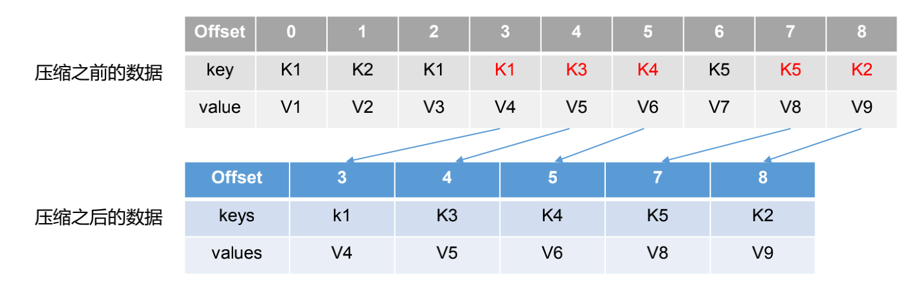

---

title: Kafka文件清理策略
author: John Doe
tags:
  - 清楚策略
categories:
  - Kafka
date: 2022-03-12 11:19:00
---

Kafka 中默认的日志保存时间为 7 天，可以通过调整如下参数修改保存时间。
⚫ log.retention.hours，最低优先级小时，默认 7 天。

⚫ log.retention.minutes，分钟。 

⚫ log.retention.ms，最高优先级毫秒。 

⚫log.retention.check.interval.ms，负责设置检查周期，默认 5 分钟。

对于超过设置事件的数据，有两种清楚策略，delete和Compact

1）delete 日志删除：将过期数据删除

⚫ log.cleanup.policy = delete 所有数据启用删除策略

（1）基于时间：默认打开。以 segment 中所有记录中的最大时间戳作为该文件时间戳。

（2）基于大小：默认关闭。超过设置的所有日志总大小，删除最早segment。log.retention.bytes，默认等于-1，表示无穷大。

2）compact 日志压缩

compact日志压缩：对于相同key的不同value值，只保留最后一个版本。

⚫ log.cleanup.policy = compact 所有数据启用压缩策略

 

压缩后的offset可能是不连续的，比如上图中没有6，当从这些offset消费消息时，将会拿到比这个offset大 的offset对应的消息，实际上会拿到offset为7的消息，并从这个位置开始消费。

这种策略只适合特殊场景，比如消息的key是用户ID，value是用户的资料，通过这种压缩策略，整个消息
集里就保存了所有用户最新的资料。

