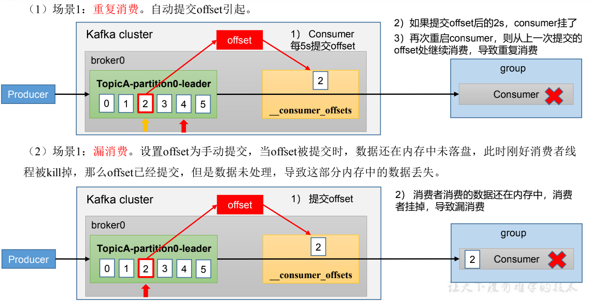

---

title: Kafka消费者漏消费和重复消费问题
author: John Doe
tags:
  - 消费者
  - 漏消费
  - 重复消费
categories:
  - Kafka
date: 2022-03-12 13:12:00
---

重复消费：已经消费了数据，但是 offset 没提交，下次还会消费到当前数据。

漏消费：先提交 offset 后消费，有可能会造成数据的漏消费。

 
 
 
如果想完成Consumer端的精准一次性消费（既不漏消费也不重复消费），那么需要Kafka消费端将消费过程和提交offset
过程做原子绑定。此时我们需要将Kafka的offset保存到支持事务的自定义介质（比 如MySQL）。

    参考：https://blog.csdn.net/qingqing7/article/details/80054281?spm=1001.2101.3001.6650.14&utm_medium=distribute.pc_relevant.none-task-blog-2%7Edefault%7EBlogCommendFromBaidu%7ERate-14.pc_relevant_default&depth_1-utm_source=distribute.pc_relevant.none-task-blog-2%7Edefault%7EBlogCommendFromBaidu%7ERate-14.pc_relevant_default&utm_relevant_index=25
