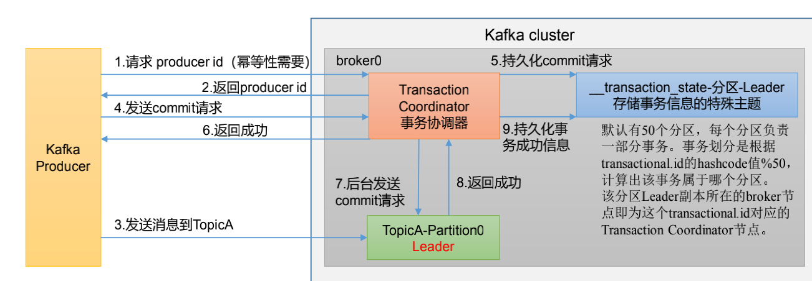

---

title: Kafka的生产者事务原理
author: John Doe
tags:
  - 事务
  - Kafka
categories:
  - Kafka
date: 2022-03-12 10:29:00
---

注意：开启事务，必须要开启幂等性。另外Procuder在使用事务功能前，必须先自定义一个唯一的transaction.id。有了transaction.id，即使客户端挂掉了，它重启后也能继续处理未完成的事务。

 
 
 