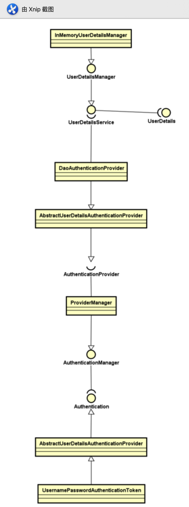

---

title: Spring Security认证过程
author: John Doe
tags:
  - 认证
categories:
  - Spring Security
date: 2022-03-11 21:54:00
---
我们知道Spring Security的核心就是认证和授权，但是具体它是如何进行认证和授权的呢？下面让我们来聊聊Spring Security的认证过程，具体步骤如下图所示：

 
 
 在开始之前，我们需要了解一下如下类：
 
 
AuthenticationManager核心验证器，该对象提供了认证方法的入口，接收一个Authentiation对象作为参数。

	      public interface AuthenticationManager {
        	Authentication authenticate(Authentication authentication)
        			throws AuthenticationException;
        }
        
ProviderManager：它是 AuthenticationManager 的一个实现类，提供了基本的认证逻辑和方法；它包含了一个 List< AuthenticationProvider> 对象，通过 AuthenticationProvider 接口来扩展出不同的认证提供者(当Spring Security默认提供的实现类不能满足需求的时候可以扩展AuthenticationProvider 覆盖supports(Class< ? > authentication)方法)；

具体验证逻辑：

AuthenticationManager 接收 Authentication 对象作为参数，并通过 authenticate(Authentication) 方法对其进行验证；AuthenticationProvider实现类用来支撑对 Authentication 对象的验证动作；UsernamePasswordAuthenticationToken实现了 Authentication主要是将用户输入的用户名和密码进行封装，并供给 AuthenticationManager 进行验证；验证完成以后将返回一个认证成功的 Authentication 对象；

