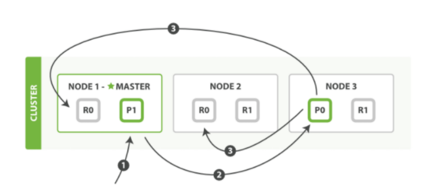

---

title: Elasticsearch分片控制
author: John Doe
tags:
  - Elasticsearch
  - 分片
categories:
  - Elasticsearch
date: 2022-03-14 14:55:00
---

每个节点都有能力处理任意请求。 每个节点都知道集群中任一文档位置，所以可以直接将请求转发到需要的节点上。

写流程：

新建、索引和删除 请求都是 写 操作， 必须在主分片上面完成之后才能被复制到相关的副本分片

 
 
 新建，索引和删除文档所需要的步骤顺序：

1. 客户端向 Node 1 发送新建、索引或者删除请求。

2. 节点使用文档的 _id 确定文档属于分片 0 。请求会被转发到 Node 3，因为分片 0 的主分片目前被分配在 Node 3 上。

3. Node 3 在主分片上面执行请求。如果成功了，它将请求并行转发到 Node 1 和 Node 2 的副本分片上。一旦所有的副本分片都报告成功, Node 3 将向协调节点报告成功，协调节点向客户端报告成功。

在客户端收到成功响应时，文档变更已经在主分片和所有副本分片执行完成，变更是安全的。有一些可选的请求参数允许您影响这个过程，可能以数据安全为代价提升性能。

读流程：我们可以从主分片或者从其它任意副本分片检索文档。

从主分片或者副本分片检索文档的步骤顺序：

1. 客户端向 Node 1 发送获取请求。

2. 节点使用文档的 _id 来确定文档属于分片 0 。分片 0 的副本分片存在于所有的三个节点上。 在这种情况下，它将请求转发到 Node 2 。

3. Node 2 将文档返回给 Node 1 ，然后将文档返回给客户端。在处理读取请求时，协调结点在每次请求的时候都会通过轮询所有的副本分片来达到负载均衡。在文档被检索时，已经被索引的文档可能已经存在于主分片上但是还没有复制到副本分片。 在这种情况下，副本分片可能会报告文档不存在，但是主分片可能成功返回文档。 一旦索引请求成功返回给用户，文档在主分片和副本分片都是可用的。

更新流程：

1. 客户端向 Node 1 发送更新请求。

2. 它将请求转发到主分片所在的 Node 3 。

3. Node 3 从主分片检索文档，修改 _source 字段中的 JSON ，并且尝试重新索引主分片的文档。如果文档已经被另一个进程修改，它会重试步骤 3 ，超过 retry_on_conflict 次后放弃。

4. 如果 Node 3 成功地更新文档，它将新版本的文档并行转发到 Node 1 和 Node 2 上的副本分片，重新建立索引。一旦所有副本分片都返回成功， Node 3 向协调节点也返回成功，协调节点向客户端返回成功。

注意：当主分片把更改转发到副本分片时， 它不会转发更新请求。 相反，它转发完整文档的新版本。请记住，这些更改将会异步转发到副本分片，并且不能保证它们以发送它们相同的顺序到达。 如果 Elasticsearch 仅转发更改请求，则可能以错误的顺序应用改，导致得到损坏的文档。

多文档操作流程：mget 和 bulk API 的模式类似于单文档模式。区别在于协调节点知道每个文档存在于哪个分片中。它将整个多文档请求分解成每个分片的多文档请求，并且将这些请求并行转发到每个参与节点。协调节点一旦收到来自每个节点的应答，就将每个节点的响应收集整理成单个响应，返回给客户端。

用单个 mget 请求取回多个文档所需的步骤顺序:

1. 客户端向 Node 1 发送 mget 请求。

2. Node 1 为每个分片构建多文档获取请求，然后并行转发这些请求到托管在每个所需的主分片或者副本分片的节点上。一旦收到所有答复， Node 1 构建响应并将其返回给客户端

bulk API 按如下步骤顺序执行：

1. 客户端向 Node 1 发送 bulk 请求。

2. Node 1 为每个节点创建一个批量请求，并将这些请求并行转发到每个包含主分片的节点主机。

3. 主分片一个接一个按顺序执行每个操作。当每个操作成功时，主分片并行转发新文档（或删除）到副本分片，然后执行下一个操作。 一旦所有的副本分片报告所有操作成功，该节点将向协调节点报告成功，协调节点将这些响应收集整理并返回给客户端。

