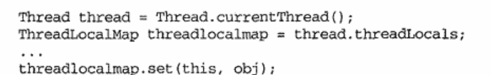

---

title: 对ThreadLocal的理解
author: John Doe
tags:
  - ThreadLocal
  - 多线程
categories:
  - 多线程
  - ThreadLocal
date: 2022-03-18 22:22:00
---

## 理解

ThreadLocal是Java语言提供用于支持线程局部变量的标准实现类。

在我们编写的代码层面来讲，我们所编写的代码实际上是在管理系统中各个对象的相关状态。如果不能够对各个对象状态的访问进行合理的管理，对象的状态将被破坏，进而导致系统的不正常运行。特别是多线程环境下，多个线程可能同时对系统中的单一或多个对象状态进行访问，如果不能保证在此期间的线程安全，整个系统将会走向崩溃的方向。

当然，很容易想到的就是你可以使用synchronization的方式上锁来解决多线程下的线程安全问题，但是这种方式无疑是一个重量级的方式，上了synchronization锁，性能消耗很大。

那怎么解决呢？synchronization方式是避免了同一时刻多个线程对共享对象的访问，将之变为同步访问。而此时，其实也可以通过ThreadLocal避免对象共享，来达到线程安全。共享对象在个线程内都有一个副本，线程对副本进行操作，结束后再修改共享变量，达到线程安全。

因此从上面来看，其实synchronization和ThreadLocal在保证线程安全方式上，前者像是从纵向上的一种方式，而后者则是横向上的一种方式。

## 实现

虽然是通过ThreadLocal来设定于各个线程的数据资源，但ThreadLocal自身不会保存这些特定的资源数据的。因为数据资源位于对应的线程，由线程管理，而每个线程有一个ThreadLocal.ThreadLocalMap类型的名为ThreadLocal的实例变量，它就是保持那些通过ThreadL哦按差设置给这个资源的地方。当通过ThreadLocal的set方法设置数据的时候，Threadloacl会获取当前这个线程的引用，然后通过该引用获取当前线程的threadLocals，然后将当前线程当做key，将要设置的数据设置到当前线程
 
事实上，ThreadLocal就好像是一个窗口，通过这个窗口，我们可以将特定于线程的线程的数据资源绑定到当前线程，也可以通过这个窗口获取绑定的资源。在整个线程的生命周期，我们都可以通过ThreadLoacl这个窗口与当前线程打交道。
- 类比城市的各个公交线，就好似系统中的个个线程，在各个公交线上，会有对应的公交车（ThreadLocal），用于运送特定线路的乘客（数据资源），乘客可以下车或上车（数据的装载和清除），在整条路线上都有各个乘车点（处理数据），最终达到终点（线程消亡）。

## ThreadLocal的理解

- 管理应用程序实现中的线程安全。对于某些有状态的或者非状态的线程安全对象，可以在多线程为某个线程分配对应副本，而不是让多个线程共享该类型的某个对象，从而避免了需要多线程对这些对象进行访问的危险工作。（比如使用JDBC进行数据库访问的过程中，connection对象就属于那种有状态并且非线程安全的类，我们通过ThreadLocal为每个线程分配一个特有的connection保证数据访问安全）

- 我们也可以通过ThreadLocal来跟踪保存在线程内的日志序列，在程序执行的任何必要点将系统跟踪信息追加到ThreadLocal，然后在合适的时点取出分析。

- 我们还可以通过ThreadLocal来保存某个全局变量，在合适的时点取出做某些逻辑。采用ThreadLocal在当前执行的线程类执行数据流转，可以表面耦合性很强的参数传递。（这种处理方式有一种让数据随波逐流的意思，一旦处理不当，甚至会令系统出现差异） 

- 某些情况下的性能优化（即以空间换取时间的方式）

- per-thread Singleton，当某项资源的初始化代价很大，并且在执行中会多次创建，可以存入threadloca避免多次创建。

