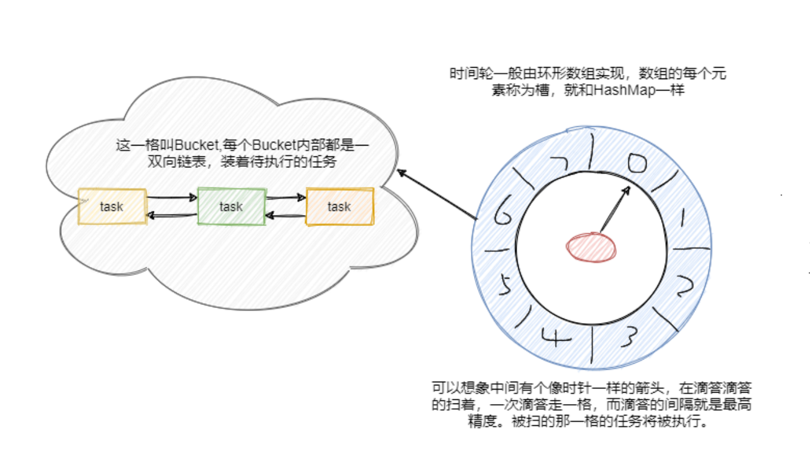

---

title: 时间轮算法
author: John Doe
tags:
  - 算法
  - 时间轮
categories:
  - 算法
  - Kafka
date: 2022-03-13 13:08:00
---

时间轮就是和手表时钟很相似的存在。时间轮用环形数组实现，数组的每个元素可以称为槽，和 HashMap一样称呼。

槽的内部用双向链表存着待执行的任务，添加和删除的链表操作时间复杂度都是 O(1)，槽位本身也指代时间精度，比如一秒扫一个槽，那么这个时间轮的最高精度就是 1 秒。

也就是说延迟 1.2 秒的任务和 1.5 秒的任务会被加入到同一个槽中，然后在 1 秒的时候遍历这个槽中的链表执行任务。

 
 
从图中可以看到此时指针指向的是第一个槽，一共有八个槽0~7，假设槽的时间单位为 1 秒，现在要加入一个延时 5 秒的任务，计算方式就是 5 % 8 + 1 = 6，即放在槽位为 6，下标为 5 的那个槽中。

更具体的就是拼到槽的双向链表的尾部。然后每秒指针顺时针移动一格，这样就扫到了下一格，遍历这格中的双向链表执行任务。然后再循环继续。

可以看到插入任务从计算槽位到插入链表，时间复杂度都是O(1)。那假设现在要加入一个50秒后执行的任务怎么办？这槽好像不够啊？难道要加槽嘛？和HashMap一样扩容？

不是的，常见有两种方式，一种是通过增加轮次的概念。50 % 8 + 1 = 3，即应该放在槽位是 3，下标是2 的位置。然后 (50 - 1) / 8 = 6，即轮数记为 6。也就是说当循环 6 轮之后扫到下标的 2 的这个槽位会触发这个任务。Netty中HashedWheelTimer 使用的就是这种方式。

还有一种是通过多层次的时间轮，这个和我们的手表就更像了，像我们秒针走一圈，分针走一格，分针走一圈，时针走一格。

多层次时间轮就是这样实现的。假设上图就是第一层，那么第一层走了一圈，第二层就走一格，可以得知第二层的一格就是8秒，假设第二层也是 8 个槽，那么第二层走一圈，第三层走一格，可以得知第三层一格就是 64 秒。那么一格三层，每层8个槽，一共 24 个槽时间轮就可以处理最多延迟 512 秒的任
务。

而多层次时间轮还会有降级的操作，假设一个任务延迟 500 秒执行，那么刚开始加进来肯定是放在第三层的，当时间过了 436 秒后，此时还需要 64 秒就会触发任务的执行，而此时相对而言它就是个延迟 64秒后的任务，因此它会被降低放在第二层中，第一层还放不下它。再过个 56 秒，相对而言它就是个延迟 8 秒后执行的任务，因此它会再被降级放在第一层中，等待执行。

降级是为了保证时间精度一致性Kafka内部用的就是多层次的时间轮算法。

Kafka 就利用了空间换时间的思想，通过 DelayQueue，来保存每个槽，通过每个槽的过期时间排序。这样拥有最早需要执行任务的槽会有优先获取。如果时候未到，那么 delayQueue.poll 就会阻塞着，这样就不会有空推进的情况发送。

总的来说Kafka用了多层次时间轮来实现，并且是按需创建时间轮，采用任务的绝对时间来判断延期，并且对于每个槽(槽内存放的也是任务的双向链表)都会维护一个过期时间，利用 DelayQueue 来对每个槽的过期
时间排序，来进行时间的推进，防止空推进的存在。

每次推进都会更新 currentTime 为当前时间戳，当然做了点微调使得 currentTime 是 tickMs 的整数
倍。并且每次推进都会把能降级的任务重新插入降级。

可以看到这里的 DelayQueue 的元素是每个槽，而不是任务，因此数量就少很多了，这应该是权衡了对于槽操作的延时队列的时间复杂度与空推进的影响。

总结：

Timer、DelayQueue 和 ScheduledThreadPool，它们都是基于优先队列实现的，O(logn)
的时间复杂度在任务数多的情况下频繁的入队出队对性能来说有损耗。因此适合于任务数不多的情况。

Timer 是单线程的会有阻塞的风险，并且对异常没有做处理，一个任务出错 Timer 就挂了。而
ScheduledThreadPool 相比于 Timer 首先可以多线程来执行任务，并且线程池对异常做了处理，使得任务之间不会有影响。

并且 Timer和ScheduledThreadPool 可以周期性执行任务。 而 DelayQueue 就是个具有优先级的阻塞队列。

对比而言时间轮更适合任务数很大的延时场景，它的任务插入和删除时间复杂度都为O(1)。对于延迟超过时间轮所能表示的范围有两种处理方式，一是通过增加一个字段-轮数，Netty 就是这样实现的。二是多层次时间轮，Kakfa 是这样实现的。

相比而言 Netty 的实现会有空推进的问题，而 Kafka 采用 DelayQueue 以槽为单位，利用空间换时间的思想解决了空推进的问题。

可以看出延迟任务的实现都不是很精确的，并且或多或少都会有阻塞的情况，即使你异步执行，线程不够的情况下还是会阻塞。