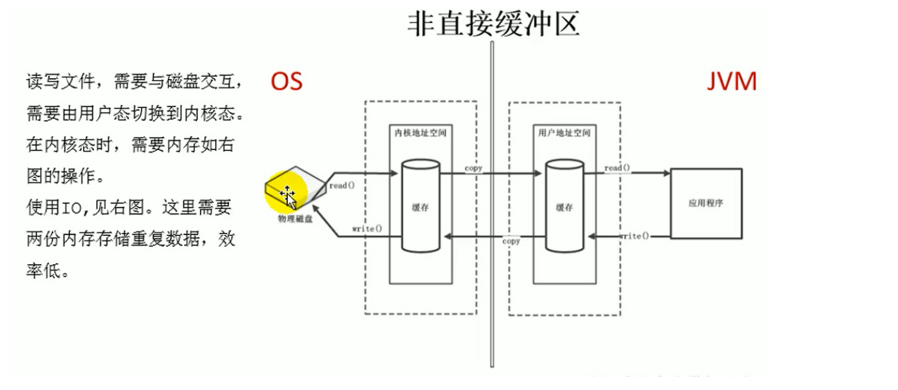

---

title: 直接内存Direct Memory
author: John Doe
tags:
  - 直接内存
categories:
  - JVM
date: 2022-03-19 18:23:00
---

直接内存Direct Memory不是虚拟机运行时数据区的一部分，也不是虚拟机规范中定义的内存区域。直接内存时Java堆外的，直接向系统申请的内存区间。

直接内存的访问速度优于java堆。读写性能更高

 
 
 存在的问题：不受指定堆大学的限定，而是受系统内存的限制。而且不受jvm内存管理回收，因此回收成本较高。
 
 MaxDirectMemorySize可以知道其大小，默认与xmx参数值一样

