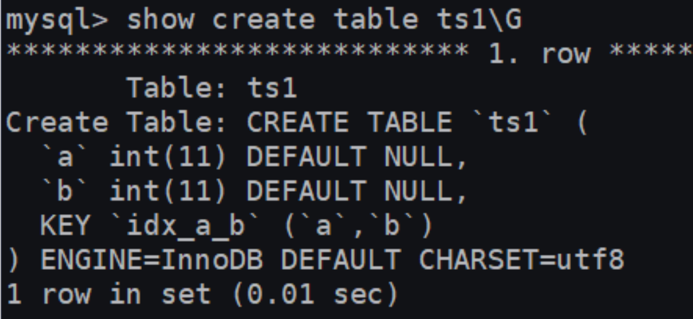
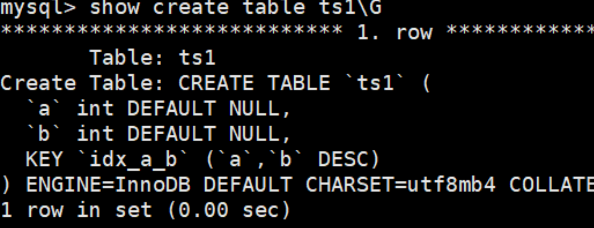

---

title: MySQL8.0索引新特性
author: John Doe
tags:
  - 新特性
  - MySQL8.0
categories:
  - MySQL
date: 2022-03-23 09:12:00
---

# 支持降序索引
分别在MySQL 5.7版本和MySQL 8.0版本中创建数据表ts1，结果如下：

    CREATE TABLE ts1(a int,b int,index idx_a_b(a,b desc));

- 5.7

 
 
- 8.0
 
 
 
降序索引在特性降序查询效率比升序自然要好，具体根据情况而进行设定。

# 隐藏索引
- 在MySQL 5.7版本及之前，只能通过显式的方式删除索引。此时，如果发现删除索引后出现错误，又只能通过显式创建索引的方式将删除的索引创建回来。如果数据表中的数据量非常大，或者数据表本身比较大，这种操作就会消耗系统过多的资源，操作成本非常高。

- 从MySQL 8.x开始支持 隐藏索引（invisible indexes） ，只需要将待删除的索引设置为隐藏索引，使查询优化器不再使用这个索引（即使使用force index（强制使用索引），优化器也不会使用该索引），确认将索引设置为隐藏索引后系统不受任何响应，就可以彻底删除索引。 这种通过先将索引设置为隐藏索引，再删除索引的方式就是软删除 。

注意：注意 当索引被隐藏时，它的内容仍然是和正常索引一样实时更新的。如果一个索引需要长期被隐藏，那么可以将其删除，因为索引的存在会影响插入、更新和删除的性能。