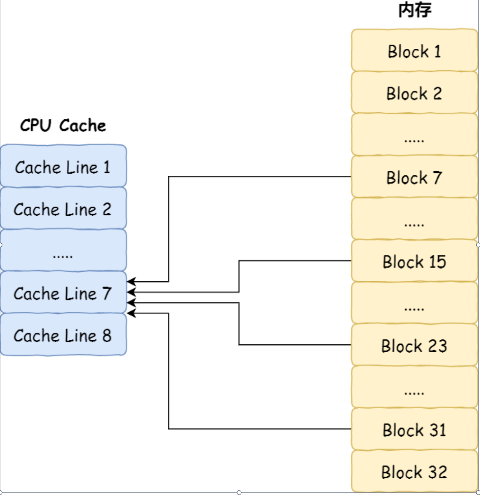
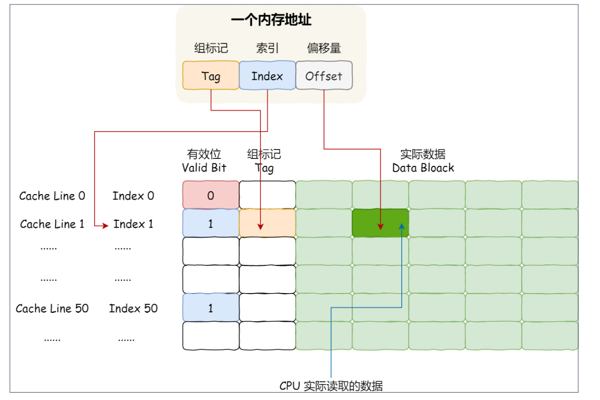

---

title: CPU Cache的数据结构和读取过程
author: John Doe
tags:
  - 计算机组成原理
  - Cache
  - CPU
categories:
  - Cache
date: 2022-07-10 21:43:00
---

CPU Cache 的数据是从内存中读取过来的，它是以⼀⼩块⼀⼩块读取数据的，⽽不是按照单个数组元素来读取数据的，在 CPU Cache 中的，这样⼀⼩块⼀⼩块的数据，称为Cache Line（缓存块）。

事实上，CPU 读取数据的时候，⽆论数据是否存放到 Cache 中，CPU 都是先访问 Cache，只有当 Cache 中找不到数据时，才会去访问内存，并把内存中的数据读⼊到 Cache 中，CPU 再从 CPU Cache 读取数据。

那 CPU 怎么知道要访问的内存数据，是否在 Cache ⾥？如果在的话，如何找到 Cache 对应的数据呢？我们从最简单、基础的直接映射 Cache（Direct Mapped Cache）说起，来看看整个 CPU Cache 的数据结构和访问逻辑。

### 直接映射
对于直接映射 Cache 采⽤的策略，就是把内存块的地址始终「映射」在⼀个 CPU Line（缓存块）的地址，⾄于映射关系实现⽅式，则是使⽤「取模运算」，取模运算的结果就是内存块地址对应的 CPU Line

举个例⼦，内存共被划分为 32 个内存块，CPU Cache 共有 8 个 CPU Line，假设 CPU 想要访问第 15 号内存块，如果 15 号内存块中的数据已经缓存在 CPU Line 中的话，则是⼀定映射在 7 号 CPU Line 中，因15 % 8 = 7

机智的你肯定发现了，使⽤取模⽅式映射的话，就会出现多个内存块对应同⼀个 CPU Line，⽐如上⾯的例⼦，除了 15 号内存块是映射在 7 号 CPU Line 中，还有 7 号、23 号、31 号内存块都是映射到 7 号 CPU Line 中。

 
 因此，为了区别不同的内存块，在对应的 CPU Line 中我们还会存储⼀个组标记（Tag）。这个组标记会记录当前 CPU Line 中存储的数据对应的内存块，我们可以⽤这个组标记来区分不同的内存块。
 
 除了组标记信息外，CPU Line 还有两个信息：
 
 - ⼀个是，从内存加载过来的实际存放数据（Data）。
 - 另⼀个是，有效位（Valid bit），它是⽤来标记对应的 CPU Line 中的数据是否是有效的，如果有效位是 0，⽆论 CPU Line 中是否有数据，CPU 都会直接访问内存，重新加载数据。
 
 CPU 在从 CPU Cache 读取数据的时候，并不是读取 CPU Line 中的整个数据块，⽽是读取 CPU 所需要的⼀个数据⽚段，这样的数据统称为⼀个字（Word）。那怎么在对应的 CPU Line 中数据块中找到所需的字呢？答案是，需要⼀个偏移量（Offset）。
 
 因此，⼀个内存的访问地址，包括组标记、CPU Line 索引、偏移量这三种信息，于是 CPU 就能通过这些信息，在 CPU Cache 中找到缓存的数据。⽽对于 CPU Cache ⾥的数据结构，则是由索引 + 有效位 + 组标记 + 数据块组成。
  
 
 
 如果内存中的数据已经在 CPU Cahe 中了，那 CPU 访问⼀个内存地址的时候，会经历这 4 个步骤：
1. 根据内存地址中索引信息，计算在 CPU Cahe 中的索引，也就是找出对应的 CPU Line 的地址；
2. 找到对应 CPU Line 后，判断 CPU Line 中的有效位，确认 CPU Line 中数据是否是有效的，如果是⽆效的，CPU 就会直接访问内存，并重新加载数据，如果数据有效，则往下执⾏；
3. 对⽐内存地址中组标记和 CPU Line 中的组标记，确认 CPU Line 中的数据是我们要访问的内存数据，如果不是的话，CPU 就会直接访问内存，并重新加载数据，如果是的话，则往下执⾏；
4. 根据内存地址中偏移量信息，从 CPU Line 的数据块中，读取对应的字。
到这⾥，相信你对直接映射 Cache 有了⼀定认识，但其实除了直接映射 Cache 之外，还有其他通过内存地址找到 CPU Cache 中的数据的策略，⽐如全相连 Cache （Fully Associative Cache）、组相连 Cache（Set Associative Cache）等，这⼏种策策略的数据结构都⽐较相似，我们理解了直接映射 Cache 的⼯作⽅式，其他的策略如果你有兴趣去看，相信很快就能理解的了。
