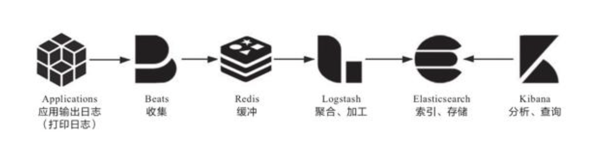

---

title: 事件日志
author: John Doe
tags:
  - 日志
  - 分布式
categories:
  - 分布式
date: 2022-07-29 15:52:00
---
“日志用于记录系统运行期间发生过的离散事件。”

 
 
 从打印日志到分析查询之间，隔着收集、缓冲、聚合、加工、索引、存储等若干个步骤，这一整个链条中涉及大量值得注意的细节，复杂性并不亚于任何一项技术或业务功能的实现。
 
 ### 日志输出
从日志输出值得注意的事项开始，日志的输出应避免以下情况：
- 避免打印敏感信息。
- 避免引用慢操作。
- 避免打印追踪诊断信息：日志中不要打印方法输入参数、输出结果、方法执行时长之类的调试信息。日志的职责是记录时间，追踪诊断应由链路系统去做。
- 避免误导他人：日志中给日后调试除错的人挖坑是十分恶劣却又常见的行为。
- 处理请求时的TraceID：服务收到请求时，如果该请求没有附带TraceID，就应该自动生成唯一的TraceID来对请求进行标记，并使用MDC自动输出到日志。“TraceID会贯穿整条调用链，目的是通过它把请求在分布式系统各个服务中的执行过程串联起来。TraceID通常也会随着请求的响应返回到客户端，如果响应内容出现了异常，用户便能通过此ID快速找到与问题相关的日志。”
- 系统运行过程中的关键事件
- 启动时输出配置信息。

### 收集与缓存
“为了能看到跨节点的全部日志，就要有能覆盖整个链路的全局日志系统。这个需求决定了每个节点输出日志到文件后，必须将日志文件统一收集起来集中存储、索引，由此便催生了专门的日志收集器。”

“日志收集器不仅要保证能覆盖全部数据来源，还要尽力保证日志数据的连续性，这其实并不容易做到。譬如淘宝这类大型的互联网系统，每天的日志量超过了10 000TB（10PB）量级，日志收集器的部署实例数能到达百万量级[1]，此时归集到系统中的日志要与实际产生的日志保持绝对的一致性是非常困难的，也不应该为此付出过高成本。换言之，日志不追求绝对的完整精确，只追求在代价可承受的范围内尽可能地保证较高的数据质量。一种最常用的缓解压力的做法是将日志接收者从Logstash和Elasticsearch转移至抗压能力更强的队列缓存，譬如在Logstash之前架设一个Kafka或者Redis作为缓冲层，面对突发流量，Logstash或Elasticsearch处理能力出现瓶颈时自动削峰填谷，甚至当它们短时间停顿时，也不会丢失日志数据。”

### 加工与聚合
“在将日志集中收集之后，存入Elasticsearch之前，一般还要对它们进行加工转换和聚合处理。这是因为日志是非结构化数据，一行日志中通常会包含多项信息，如果不做处理，那在Elasticsearch中就只能以全文检索的原始方式去使用日志，既不利于统计对比，也不利于条件过滤。”

### 存储与查询
“经过收集、缓冲、聚合、加工的日志数据，终于可以放入Elasticsearch中索引存储了。Elasticsearch是整个Elastic Stack技术栈的核心，其他步骤的工具，如Filebeat、Logstash、Kibana都有替代品，有自由选择的余地，唯独Elasticsearch在日志分析这方面完全没有什么值得一提的竞争者，几乎就是解决此问题的唯一答案。这样的结果与Elasticsearch本身是一款优秀产品有关，然而更关键的是Elasticsearch的优势正好与日志分析的需求完美契合。”
