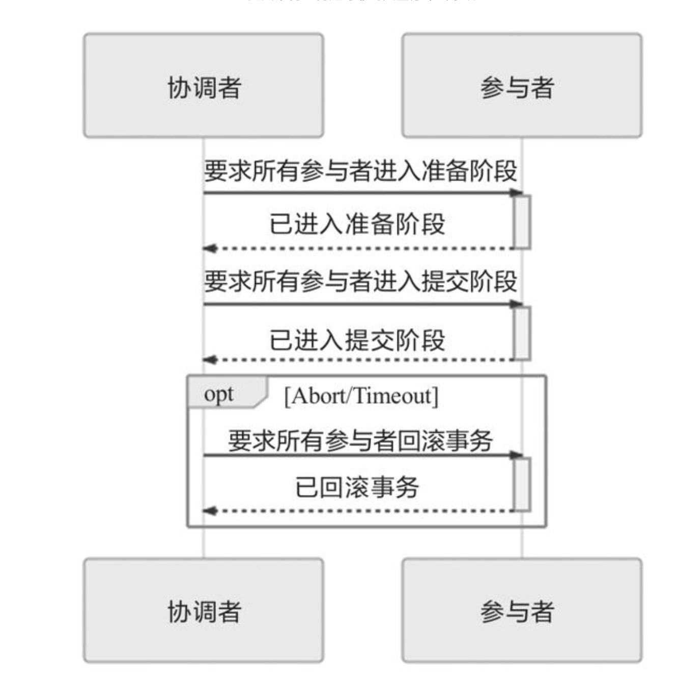
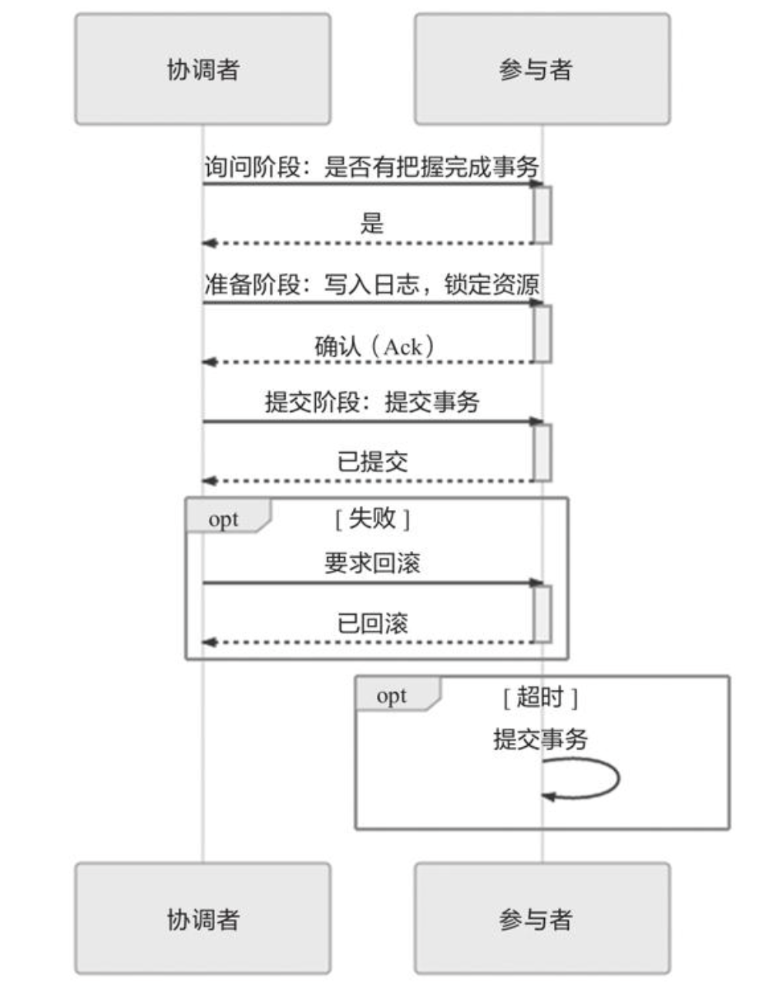

---

title: 事务处理（一）
author: John Doe
tags:
  - 分布式
  - 事务
categories:
  - 事务
date: 2022-07-28 10:03:00
---

“事务处理几乎在每一个信息系统中都会涉及，它存在的意义是为了保证系统中所有的数据都是符合期望的，且相互关联的数据之间不会产生矛盾，即数据状态的一致性（Consistency）。按照数据库的经典理论，要达成这个目标，需要三方面共同努力来保障。

·原子性（Atomic）：在同一项业务处理过程中，事务保证了对多个数据的修改，要么同时成功，要么同时被撤销。

·隔离性（Isolation）：在不同的业务处理过程中，事务保证了各业务正在读、写的数据相互独立，不会彼此影响。

·持久性（Durability）：事务应当保证所有成功被提交的数据修改都能够正确地被持久化，不丢失数据。”

“A、I、D是手段，C是目的，前者是因，后者是果”

“当一个服务只使用一个数据源时，通过A、I、D来获得一致性是最经典的做法，也是相对容易的。此时，多个并发事务所读写的数据能够被数据源感知是否存在冲突，并发事务的读写在时间线上的最终顺序是由数据源来确定的，这种事务间一致性被称为“内部一致性”。 
 ·当一个服务使用到多个不同的数据源，甚至多个不同服务同时涉及多个不同的数据源时，问题就变得困难了许多。此时，并发执行甚至是先后执行的多个事务，在时间线上的顺序并不由任何一个数据源来决定，这种涉及多个数据源的事务间一致性被称为“外部一致性”。”
 
 “外部一致性问题通常很难使用A、I、D来解决，因为这样需要付出很大甚至不切实际的代价；但是外部一致性又是分布式系统中必然会遇到且必须要解决的问题，为此我们要转变观念，将一致性从“是或否”的二元属性转变为可以按不同强度分开讨论的多元属性，在确保代价可承受的前提下获得强度尽可能高的一致性保障”

### 本地事务
“本地事务是指仅操作单一事务资源的、不需要全局事务管理器进行协调的事务”

“本地事务是一种最基础的事务解决方案，只适用于单个服务使用单个数据源的场景。从应用角度看，它是直接依赖于数据源本身提供的事务能力来工作的，在程序代码层面，最多只能对事务接口做一层标准化的包装（如JDBC接口），并不能深入参与到事务的运作过程中，事务的开启、终止、提交、回滚、嵌套、设置隔离级别，乃至与应用代码贴近的事务传播方式，全部都要依赖底层数据源的支持才能工作，这一点与后续介绍的XA、TCC、SAGA等主要靠应用程序代码来实现的事务有着十分明显的区别。”

“原子性和持久性在事务里是密切相关的两个属性：原子性保证了事务的多个操作要么都生效要么都不生效，不会存在中间状态；持久性保证了一旦事务生效，就不会再因为任何原因而导致其修改的内容被撤销或丢失。”

“实现原子性和持久性的最大困难是“写入磁盘”这个操作并不是原子的，不仅有“写入”与“未写入”状态，还客观存在着“正在写”的中间状态。由于写入中间状态与崩溃都不可能消除，所以如果不做额外保障措施的话，将内存中的数据写入磁盘，并不能保证原子性与持久性。”

“为了能够顺利地完成崩溃恢复，在磁盘中写入数据就不能像程序修改内存中的变量值那样，直接改变某表某行某列的某个值，而是必须将修改数据这个操作所需的全部信息，包括修改什么数据、数据物理上位于哪个内存页和磁盘块中、从什么值改成什么值，等等，以日志的形式——即以仅进行顺序追加的文件写入的形式（这是最高效的写入方式）先记录到磁盘中。只有在日志记录全部安全落盘，数据库在日志中看到代表事务成功提交的“提交记录”（Commit Record）后，才会根据日志上的信息对真正的数据进行修改，修改完成后，再在日志中加入一条“结束记录”（End Record）表示事务已完成持久化，这种事务实现方法被称为“提交日志”（Commit Logging）。”

“通过日志实现事务的原子性和持久性是当今的主流方案，但并不是唯一的选择。除日志外，还有另外一种称为“Shadow Paging”（有中文资料翻译为“影子分页”）的事务实现机制，常用的轻量级数据库SQLite Version 3采用的事务机制就是Shadow Paging。”

“Shadow Paging的大体思路是对数据的变动会写到硬盘的数据中，但不是直接就地修改原先的数据，而是先复制一份副本，保留原数据，修改副本数据。在事务处理过程中，被修改的数据会同时存在两份，一份是修改前的数据，一份是修改后的数据，这也是“影子”（Shadow）这个名字的由来。当事务成功提交，所有数据的修改都成功持久化之后，最后一步是修改数据的引用指针，将引用从原数据改为新复制并“hadow Paging的大体思路是对数据的变动会写到硬盘的数据中，但不是直接就地修改原先的数据，而是先复制一份副本，保留原数据，修改副本数据。在事务处理过程中，被修改的数据会同时存在两份，一份是修改前的数据，一份是修改后的数据，这也是“影子”（Shadow）这个名字的由来。当事务成功提交，所有数据的修改都成功持久化之后，最后一步是修改数据的引用指针，将引用从原数据改为新复制并修改后的副本，最后的“修改指针”这个操作将被认为是原子操作，现代磁盘的写操作的作用可以认为是保证了在硬件上不会出现“改了半个值”的现象。所以Shadow Paging也可以保证原子性和持久性。Shadow Paging实现事务要比Commit Logging更加简单，但涉及隔离性与并发锁时，Shadow Paging实现的事务并发能力就相对有限，因此在高性能的数据库中应用”

隔离性：“不同隔离级别以及幻读、不可重复读、脏读等问题都只是表面现象，是各种锁在不同加锁时间上组合应用所产生的结果，以锁为手段来实现隔离性才是数据库表现出不同隔离级别的根本原因。”

### 全局事务
“本地事务相对的是全局事务（Global Transaction），在一些资料中也将其称为外部事务（External Transaction），在本节里，全局事务被限定为一种适用于单个服务使用多个数据源场景的事务解决方案。请注意，理论上真正的全局事务并没有“单个服务”的约束，它本来就是DTP（Distributed Transaction Processing，分布式事务处理）模型[1]中的概念，但本节讨论的是一种在分布式环境中仍追求强一致性的事务处理方案，对于多节点而且互相调用彼此服务的场合（典型的就是现在的微服务系统）是极不合适的，当前它几乎只实际应用于单服务多数据源的场合中，为了避免与后续介绍的放弃了ACID的弱一致性事务处理方式混淆，所以这里的全局事务的范围有所缩减，后续涉及多服务多数据源的事务，笔者将称其为“分布式事务”。”

“为了解决分布式事务的一致性问题，X/Open组织（后来并入了The Open Group）提出了一套名为X/Open XA（XA是eXtended Architecture的缩写）的处理事务架构，其核心内容是定义了全局的事务管理器（Transaction Manager，用于协调全局事务）和局部的资源管理器（Resource Manager，用于驱动本地事务）之间的通信接口。XA接口是双向的，能在一个事务管理器和多个资源管理器（Resource Manager）之间形成通信桥梁，通过协调多个数据源的一致动作，实现全局事务的统一提交或者统一回滚，现在我们在Java代码中还偶尔能看见的XADataSource、XAResource都源于此。

不过，XA并不是Java的技术规范（XA提出那时还没有Java），而是一套语言无关的通用规范，所以Java中专门定义了JSR 907 Java Transaction API，基于XA模式在Java语言中实现了全局事务处理的标准，这也是我们现在所熟知的JTA。”

“XA将事务提交拆分成两阶段。”

“准备阶段：又叫作投票阶段，在这一阶段，协调者询问事务的所有参与者是否准备好提交，参与者如果已经准备好提交则回复Prepared，否则回复Non-Prepared。这里所说的准备操作跟人类语言中通常理解的准备不同，对于数据库来说，准备操作是在重做日志中记录全部事务提交操作所要做的内容，它与本地事务中真正提交的区别只是暂不写入最后一条Commit Record而已，这意味着在做完数据持久化后并不立即释放隔离性，即仍继续持有锁，维持数据对其他非事务内观察者的隔离状态。

·提交阶段：又叫作执行阶段，协调者如果在上一阶段收到所有事务参与者回复的Prepared消息，则先自己在本地持久化事务状态为Commit，然后向所有参与者发送Commit指令，让所有参与者立即执行提交操作；否则，任意一个参与者回复了Non-Prepared消息，或任意一个参与者超时未回复时，协调者将在自己完成事务状态为[…]”

“以上这两个过程被称为“两段式提交”（2 Phase Commit，2PC）协议，而它能够成功保证一致性还需要一些其他前提条件。”

“必须假设网络在提交阶段的短时间内是可靠的，即提交阶段不会丢失消息。同时也假设网络通信在全过程都不会出现误差，即可以丢失消息，但不会传递错误的消息，XA的设计目标并不是解决诸如拜占庭将军一类的问题。在两段式提交中，投票阶段失败了可以补救（回滚），提交阶段失败了则无法补救（不再改变提交或回滚的结果，只能等崩溃的节点重新恢复），因而此阶段耗时应尽可能短，这也是为了尽量控制网络风险。 
 ·必须假设因为网络分区、机器崩溃或者其他原因而导致失联的节点最终能够恢复，不会永久性地处于失联状态。由于在准备阶段已经写入了完整的重做日志，所以当失联机器一旦恢复，就能够从日志中找出已准备妥当但并未提交的事务数据，进而向协调者查询该事务的状态，确定下一步应该进行提交还是回滚操作。”

 

三段式提交把原本的两段式提交的准备阶段再细分为两个阶段，分别称为CanCommit、PreCommit，把提交阶段改称为DoCommit阶段。其中，新增的CanCommit是一个询问阶段，即协调者让每个参与的数据库根据自身状态，评估该事务是否有可能顺利完成。将准备阶段一分为二的理由是这个阶段是重负载的操作，一旦协调者发出开始准备的消息，每个参与者都将马上开始写重做日志，它们所涉及的数据资源即被锁住，如果此时某一个参与者宣告无法完成提交，相当于大家都做了一轮无用功。所以，增加一轮询问阶段，如果都得到了正面的响应，那事务能够成功提交的把握就比较大了，这也意味着因某个参与者提交时发生崩溃而导致大家全部回滚的风险相对变小。因此，在事务需要回滚的场景中，三段式提交的性能通常要比两段式提交好很多，但在事务能够正常提交的场景中[…]”

 
