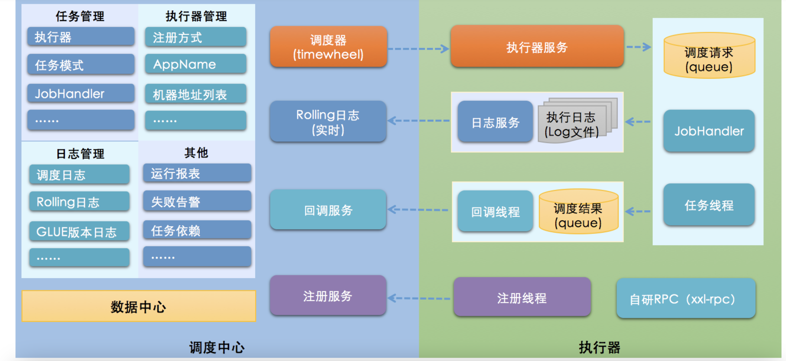

---

title: 分布式调度xxl-job
author: John Doe
tags:
  - xxl-job
  - 任务调度
categories:
  - 分布式
date: 2022-08-01 19:40:00
---
xxl-job就是一个中心化管理系统，系统主要通过MySQL管理各种定时任务信息，当到了定时任务的触发时间，就把任务信息从db中拉进内存，对任务执行器发起触发请求。这个任务执行器，既可以是bean、groovy脚本、python脚本等，也可以是外部的http接口。相比起当当网开源的elastic-job-lite（基于zookeeper作为协调器的“无中心”架构），这种中心化管理的系统其实更简单、易于维护。

### 设计思想
将调度行为抽象形成“调度中心”公共平台，而平台自身并不承担业务逻辑，“调度中心”负责发起调度请求。将任务抽象成分散的JobHandler，交由“执行器”统一管理，“执行器”负责接收调度请求并执行对应的JobHandler中业务逻辑。因此，“调度”和“任务”两部分可以相互解耦，提高系统整体稳定性和扩展性；
### 系统组成
调度模块（调度中心）：负责管理调度信息，按照调度配置发出调度请求，自身不承担业务代码。调度系统与任务解耦，提高了系统可用性和稳定性，同时调度系统性能不再受限于任务模块；支持可视化、简单且动态的管理调度信息，包括任务新建，更新，删除，GLUE开发和任务报警等，所有上述操作都会实时生效，同时支持监控调度结果以及执行日志，支持执行器Failover。

执行模块（执行器）：负责接收调度请求并执行任务逻辑。任务模块专注于任务的执行等操作，开发和维护更加简单和高效；接收“调度中心”的执行请求、终止请求和日志请求等。

### 架构图
 
 
 ### quartz的不足
 Quartz作为开源作业调度中的佼佼者，是作业调度的首选。但是集群环境中Quartz采用API的方式对任务进行管理，从而可以避免上述问题，但是同样存在以下问题：

- 问题一：调用API的的方式操作任务，不人性化；
- 问题二：需要持久化业务QuartzJobBean到底层数据表中，系统侵入性相当严重。
- 问题三：调度逻辑和QuartzJobBean耦合在同一个项目中，这将导致一个问题，在调度任务数量逐渐增多，同时调度任务逻辑逐渐加重的情况下，此时调度系统的性能将大大受限于业务；
- 问题四：quartz底层以“抢占式”获取DB锁并由抢占成功节点负责运行任务，会导致节点负载悬殊非常大；而XXL-JOB通过执行器实现“协同分配式”运行任务，充分发挥集群优势，负载各节点均衡。

XXL-JOB弥补了quartz的上述不足之处。

### 调度模块剖析
- XXL-JOB最终选择自研调度组件（早期调度组件基于Quartz）；一方面是为了精简系统降低冗余依赖，另一方面是为了提供系统的可控度与稳定性；XXL-JOB中“调度模块”和“任务模块”完全解耦，调度模块进行任务调度时，将会解析不同的任务参数发起远程调用，调用各自的远程执行器服务。这种调用模型类似RPC调用，调度中心提供调用代理的功能，而执行器提供远程服务的功能。
- 基于数据库的集群方案，数据库选用Mysql；集群分布式并发环境中进行定时任务调度时，会在各个节点会上报任务，存到数据库中，执行时会从数据库中取出触发器来执行，如果触发器的名称和执行时间相同，则只有一个节点去执行此任务。
- 调度采用线程池方式实现，避免单线程因阻塞而引起任务调度延迟。
- XXL-JOB调度模块默认采用并行机制，在多线程调度的情况下，调度模块被阻塞的几率很低，大大提高了调度系统的承载量。XXL-JOB的不同任务之间并行调度、并行执行。XXL-JOB的单个任务，针对多个执行器是并行运行的，针对单个执行器是串行执行的。同时支持任务终止。

任务调度错过触发时间时的处理策略：
- 过期超5s：本次忽略，当前时间开始计算下次触发时间
- 过期5s内：立即触发一次，当前时间开始计算下次触发时间

### 调度日志
调度中心每次进行任务调度，都会记录一条任务日志，任务日志主要包括以下三部分内容：
- 任务信息：包括“执行器地址”、“JobHandler”和“执行参数”等属性，点击任务ID按钮可查看，根据这些参数，可以精确的定位任务执行的具体机器和任务代码；
- 调度信息：包括“调度时间”、“调度结果”和“调度日志”等，根据这些参数，可以了解“调度中心”发起调度请求时具体情况。
- 执行信息：包括“执行时间”、“执行结果”和“执行日志”等，根据这些参数，可以了解在“执行器”端任务执行的具体情况；

调度日志，针对单次调度，属性说明如下：

    执行器地址：任务执行的机器地址；
    JobHandler：Bean模式表示任务执行的JobHandler名称；
    任务参数：任务执行的入参；
    调度时间：调度中心，发起调度的时间；
    调度结果：调度中心，发起调度的结果，SUCCESS或FAIL；
    调度备注：调度中心，发起调度的备注信息，如地址心跳检测日志等；
    执行时间：执行器，任务执行结束后回调的时间；
    执行结果：执行器，任务执行的结果，SUCCESS或FAIL；
    执行备注：执行器，任务执行的备注信息，如异常日志等；
    执行日志：任务执行过程中，业务代码中打印的完整执行日志，见“4.8 查看执行日志”；
    
### 任务依赖
原理：XXL-JOB中每个任务都对应有一个任务ID，同时，每个任务支持设置属性“子任务ID”，因此，通过“任务ID”可以匹配任务依赖关系。

当父任务执行结束并且执行成功时，将会根据“子任务ID”匹配子任务依赖，如果匹配到子任务，将会主动触发一次子任务的执行。

### 全异步化&轻量级
全异步化设计：XXL-JOB系统中业务逻辑在远程执行器执行，触发流程全异步化设计。相比直接在调度中心内部执行业务逻辑，极大的降低了调度线程占用时间；
- 异步调度：调度中心每次任务触发时仅发送一次调度请求，该调度请求首先推送“异步调度队列”，然后异步推送给远程执行器

- 异步执行：执行器会将请求存入“异步执行队列”并且立即响应调度中心，异步运行。

轻量级设计：XXL-JOB调度中心中每个JOB逻辑非常 “轻”，在全异步化的基础上，单个JOB一次运行平均耗时基本在 “10ms” 之内（基本为一次请求的网络开销）；因此，可以保证使用有限的线程支撑大量的JOB并发运行；

得益于上述两点优化，理论上默认配置下的调度中心，单机能够支撑 5000 任务并发运行稳定运行；

实际场景中，由于调度中心与执行器网络ping延迟不同、DB读写耗时不同、任务调度密集程度不同，会导致任务量上限会上下波动。

如若需要支撑更多的任务量，可以通过 “调大调度线程数” 、”降低调度中心与执行器ping延迟” 和 “提升机器配置” 几种方式优化。

### 均衡调度
调度中心在集群部署时会自动进行任务平均分配，触发组件每次获取与线程池数量（调度中心支持自定义调度线程池大小）相关数量的任务，避免大量任务集中在单个调度中心集群节点；

### 任务 “运行模式” 剖析
原理：每个Bean模式任务都是一个Spring的Bean类实例，它被维护在“执行器”项目的Spring容器中。任务类需要加“@JobHandler(value=”名称”)”注解，因为“执行器”会根据该注解识别Spring容器中的任务。任务类需要继承统一接口“IJobHandler”，任务逻辑在execute方法中开发，因为“执行器”在接收到调度中心的调度请求时，将会调用“IJobHandler”的execute方法，执行任务逻辑。
### “GLUE模式(Java)” 任务
原理：每个 “GLUE模式(Java)” 任务的代码，实际上是“一个继承自“IJobHandler”的实现类的类代码”，“执行器”接收到“调度中心”的调度请求时，会通过Groovy类加载器加载此代码，实例化成Java对象，同时注入此代码中声明的Spring服务（请确保Glue代码中的服务和类引用在“执行器”项目中存在），然后调用该对象的execute方法，执行任务逻辑。

### 执行器
执行器实际上是一个内嵌的Server，默认端口9999（配置项：xxl.job.executor.port）。

在项目启动时，执行器会通过“@JobHandler”识别Spring容器中“Bean模式任务”，以注解的value属性为key管理起来。

“执行器”接收到“调度中心”的调度请求时，如果任务类型为“Bean模式”，将会匹配Spring容器中的“Bean模式任务”，然后调用其execute方法，执行任务逻辑。如果任务类型为“GLUE模式”，将会加载GLue代码，实例化Java对象，注入依赖的Spring服务（注意：Glue代码中注入的Spring服务，必须存在与该“执行器”项目的Spring容器中），然后调用execute方法，执行任务逻辑。

### 通讯模块剖析
一次完整的任务调度通讯流程

- 1、“调度中心”向“执行器”发送http调度请求: “执行器”中接收请求的服务，实际上是一台内嵌Server，默认端口9999;
- 2、“执行器”执行任务逻辑；
- 3、“执行器”http回调“调度中心”调度结果: “调度中心”中接收回调的服务，是针对执行器开放一套API服务;

调度中心向执行器发送的调度请求时使用RequestModel和ResponseModel两个对象封装调度请求参数和响应数据, 在进行通讯之前底层会将上述两个对象对象序列化，并进行数据协议以及时间戳检验,从而达到数据加密的功能;

自v1.5版本之后, 任务取消了”任务执行机器”属性, 改为通过任务注册和自动发现的方式, 动态获取远程执行器地址并执行。

为保证系统”轻量级”并且降低学习部署成本，没有采用Zookeeper作为注册中心，采用DB方式进行任务注册发现；

### 分片广播&动态分片
执行器集群部署时，任务路由策略选择”分片广播”情况下，一次任务调度将会广播触发对应集群中所有执行器执行一次任务，同时系统自动传递分片参数；可根据分片参数开发分片任务；

“分片广播” 以执行器为维度进行分片，支持动态扩容执行器集群从而动态增加分片数量，协同进行业务处理；在进行大数据量业务操作时可显著提升任务处理能力和速度。

“分片广播” 和普通任务开发流程一致，不同之处在于可以获取分片参数，获取分片参数进行分片业务处理。

1、分片任务场景：10个执行器的集群来处理10w条数据，每台机器只需要处理1w条数据，耗时降低10倍；
2、广播任务场景：广播执行器机器运行shell脚本、广播集群节点进行缓存更新等

### 访问令牌（AccessToken）

为提升系统安全性，调度中心和执行器进行安全性校验，双方AccessToken匹配才允许通讯；

调度中心和执行器，可通过配置项 “xxl.job.accessToken” 进行AccessToken的设置。

调度中心和执行器，如果需要正常通讯，只有两种设置；

设置一：调度中心和执行器，均不设置AccessToken；关闭安全性校验；
设置二：调度中心和执行器，设置了相同的AccessToken；

一次完整任务流程包括”调度（调度中心） + 执行（执行器）”两个阶段。

“故障转移”发生在调度阶段，在执行器集群部署时，如果某一台执行器发生故障，该策略支持自动进行Failover切换到一台正常的执行器机器并且完成调度请求流程。
“失败重试”发生在”调度 + 执行”两个阶段，支持通过自定义任务失败重试次数，当任务失败时将会按照预设的失败重试次数主动进行重试；

### 执行器灰度上线
调度中心与业务解耦，只需部署一次后常年不需要维护。但是，执行器中托管运行着业务作业，作业上线和变更需要重启执行器，尤其是Bean模式任务。
执行器重启可能会中断运行中的任务。但是，XXL-JOB得益于自建执行器与自建注册中心，可以通过灰度上线的方式，避免因重启导致的任务中断的问题。

步骤如下：

1、执行器改为手动注册，下线一半机器列表（A组），线上运行另一半机器列表（B组）；
2、等待A组机器任务运行结束并编译上线；执行器注册地址替换为A组；
3、等待B组机器任务运行结束并编译上线；执行器注册地址替换为A组+B组；
操作结束；

### 任务失败警告
默认提供邮件失败告警，可扩展短信、钉钉等方式。如果需要新增一种告警方式，只需要新增一个实现 “com.xxl.job.admin.core.alarm.JobAlarm” 接口的告警实现即可。可以参考默认提供邮箱告警实现 “EmailJobAlarm”。

### 避免任务重复执行
调度密集或者耗时任务可能会导致任务阻塞，集群情况下调度组件小概率情况下会重复触发；
针对上述情况，可以通过结合 “单机路由策略（如：第一台、一致性哈希）” + “阻塞策略（如：单机串行、丢弃后续调度）” 来规避，最终避免任务重复执行。

### 调度结果丢失处理
执行器因网络抖动回调失败或宕机等异常情况，会导致任务调度结果丢失。由于调度中心依赖执行器回调来感知调度结果，因此会导致调度日志永远处于 “运行中” 状态。

针对该问题，调度中心提供内置组件进行处理，逻辑为：调度记录停留在 “运行中” 状态超过10min，且对应执行器心跳注册失败不在线，则将本地调度主动标记失败；
