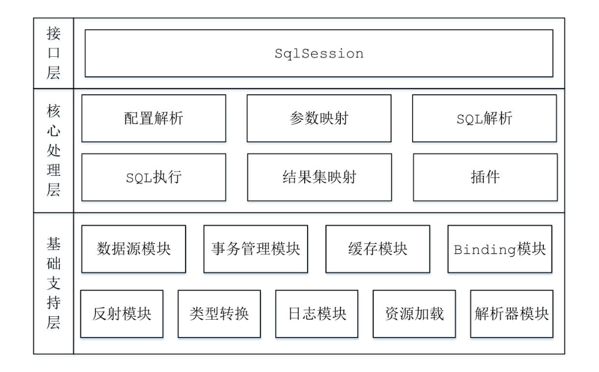
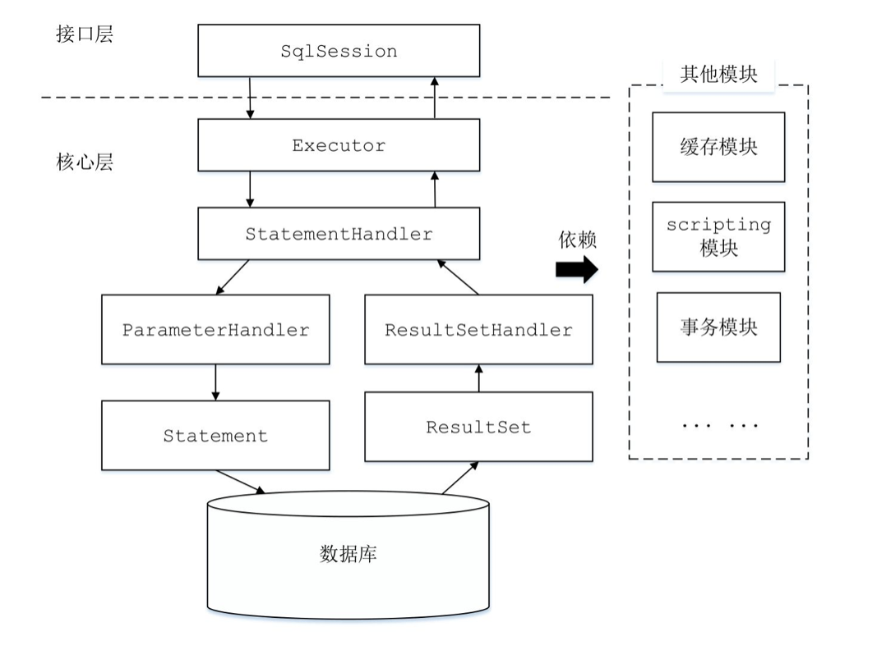

---

title: 重温Mybatis---Mybatis整体架构
author: John Doe
tags:
  - Mybatis
categories:
  - Mybatis
date: 2022-09-18 20:10:00
---

Mybatis整体架构分为三层，分别是基础层、核心层和接口层

1. 基础层：“包含整个MyBatis的基础模块，这些模块为核心处理层的功能提供了良好的支撑。”
 - 反射模块：“对Java原生的反射进行了良好的封装，提供了更加简洁易用的API，方便上层使调用，并且对反射操作进行了一系列优化，例如缓存了类的元数据，提高了反射操作的性能。”
 - 类型转换模块：“MyBatis为简化配置文件提供了别名机制，该机制是类型转换模块的主要功能之一。类型转换模块的另一个功能是实现JDBC类型与Java类型之间的转换，该功能在为SQL语句绑定实参以及映射查询结果集时都会涉及。在为SQL语句绑定实参时，会将数据由Java类型转换成JDBC类型；而在映射结果集时，会将数据由JDBC类型转换成Java类型。”
 - 日志模块：”Mybatis集成了多种日志框架“
 - 资源加载模块：”MyBatis为简化配置文件提供了别名机制，该机制是类型转换模块的主要功能之一。类型转换模块的另一个功能是实现JDBC类型与Java类型之间的转换，该功能在为SQL语句绑定实参以及映射查询结果集时都会涉及。在为SQL语句绑定实参时，会将数据由Java类型转换成JDBC类型；而在映射结果集时，会将数据由JDBC类型转换成Java类型。”
 - 解析器模块：“解析器模块的主要提供了两个功能：一个功能是对XPath进行封装，为MyBatis初始化时解析mybatis-config.xml配置文件以及映射配置文件提供支持；另一个功能是为处理动态SQL语句中的占位符提供支持。”
 - 数据源模块：”Mybatis提供的自身数据源实现和与第三方数据源集成的接口“
 - 事务模块：“MyBatis对数据库中的事务进行了抽象，其自身提供了相应的事务接口和简单实现。在很多场景中，MyBatis会与Spring框架集成，并由Spring框架管理事务”
 - 缓存模块：“MyBatis中提供了一级缓存和二级缓存，而这两级缓存都是依赖于基础支持层中的缓存模块实现的。”
 - Binging模块：“在调用SqlSession相应方法执行数据库操作时，需要指定映射文件中定义的SQL节点，如果出现拼写错误，我们只能在运行时才能发现相应的异常。为了尽早发现这种错误，MyBatis通过Binding模块将用户自定义的Mapper接口与映射配置文件关联起来，系统可以通过调用自定义Mapper接口中的方法执行相应的SQL语句完成数据库操作，从而避免上述问题。”

2. 核心处理层：“在核心处理层中实现了MyBatis的核心处理流程，其中包括MyBatis的初始化以及完成一次数据库操作的涉及的全部流程。”
  - 配置解析：“在MyBatis初始化过程中，会加载mybatis-config.xml配置文件、映射配置文件以及Mapper接口中的注解信息，解析后的配置信息会形成相应的对象并保存到Configuration对象中。之后利用configuration创建sqlsessionFactory对象，待MyBatis初始化之后，开发人员可以通过初始化得到SqlSessionFactory创建SqlSession对象并完成数据库操作。”
  - SQL解析与scripting模块：“MyBatis实现动态SQL语句的功能，提供了多种动态SQL语句对应的节点，例如，＜where＞节点、＜if＞节点、＜foreach＞节点等。通过这些节点的组合使用，开发人员可以写出几乎满足所有需求的动态SQL语句。”
  - SQL执行：“SQL语句的执行涉及多个组件，其中比较重要的是Executor、StatementHandler、ParameterHandler和ResultSetHandler。Executor主要负责维护一级缓存和二级缓存，并提供事务管理的相关操作，它会将数据库相关操作委托给StatementHandler完成。StatementHandler首先通过ParameterHandler完成SQL语句的实参绑定，然后通过java.sql.Statement对象执行SQL语句并得到结果集，最后通过ResultSetHandler完成结果集的映射，得到结果对象并返回。”

 
 
 - 插件：“MyBatis提供了插件接口，我们可以通过添加用户自定义插件的方式对MyBatis进行扩展。用户自定义插件也可以改变Mybatis的默认行为”

3. 接口层：“接口层相对简单，其核心是SqlSession接口，该接口中定义了MyBatis暴露给应用程序调用的API，也就是上层应用与MyBatis交互的桥梁。接口层在接收到调用请求时，会调用核心处理层的相应模块来完成具体的数据库操作。”

摘录来自
MyBatis技术内幕
徐郡明

